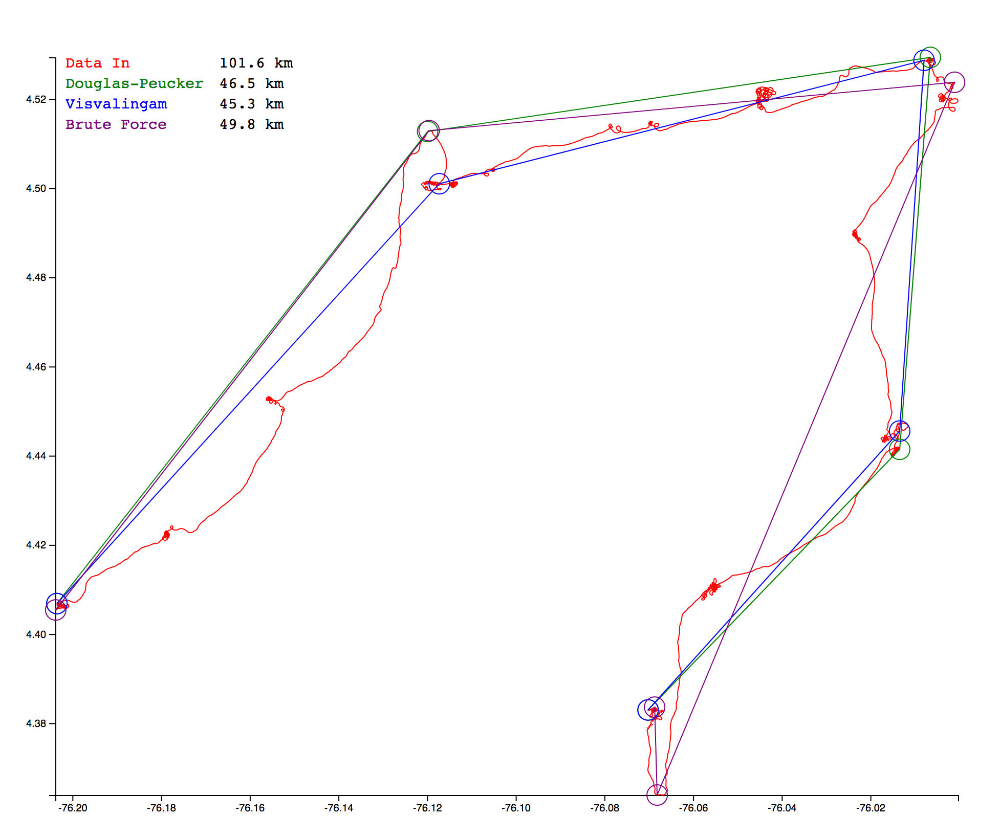

# line-simplify

Go implementation of line simplification algorithms, with results plotted using D3.

This work is specifically for simplification of GPS track plots, in the example case for FAI/IGC Flight Recorder Data Format files (e.g. for paragliding, sailplane flying etc).

Currently all distances between points for the algorithms are on a straight-line basis- ultimately it could make sense to calculate them using the Haversine formula, which takes into account the curve of the earth. Total distances of the results are computed this way.

## Example Plot

A tracklog from a cross-country paragliding flight in Colombia provides the input dataset.
Total lengths of tracklogs for the original info and for the results of each simplification algorithm are shown. The classic 3 turnpoint calculation is shown.

## Algorithms

* Douglas-Peucker
* Visvalingam
* "Brute Force" OLC method

### Douglas-Peucker

The purpose of the algorithm is, given a curve composed of line segments (which is also called a Polyline in some contexts), to find a similar curve with fewer points. The algorithm defines 'dissimilar' based on the maximum distance between the original curve and the simplified curve (i.e., the Hausdorff distance between the curves). The simplified curve consists of a subset of the points that defined the original curve.

More [Douglas-Peucker](https://en.wikipedia.org/wiki/Ramer%E2%80%93Douglas%E2%80%93Peucker_algorithm) info

### Visvalingam

This algorithm performs a line simplification that produces less angular results than the filtering algorithm of Douglas and Peucker. The algorithm was proposed by Visvalingam & Whyatt 1993.

The principle of the algorithm is to select the vertices to delete (the less characteristic ones) rather than choosing the vertices to keep (in the Douglas and Peucker algorithm). To select the vertices to delete, there is an iterative process, and at each iteration, the triangles formed by three consecutive vertices are computed. If the area of the smallest triangle is smaller than a threshold (“area_tolerance” parameter), the middle vertex is deleted, and another iteration starts.

More [Visvalingam](https://ignf.github.io/CartAGen/docs/algorithms/line/visvalingam.html) info

### "Brute Force" OLC method

This is the original code from 2002 which is used for Leonardo track optimizations. It calculates every possible distance permutation from all points in a tracklog and then determines the optimal longest path with 3 turnpoints. It is slow even for <1000 points but calculation times can run into the minutes with larger tracklogs, due to its O(n^2) complexity.